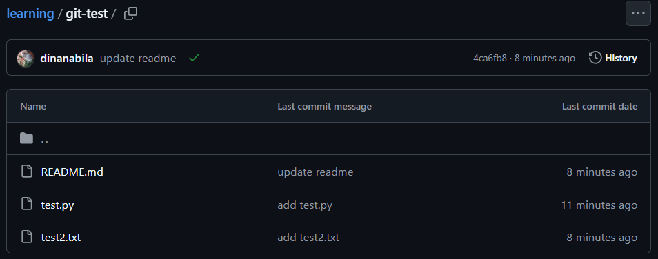
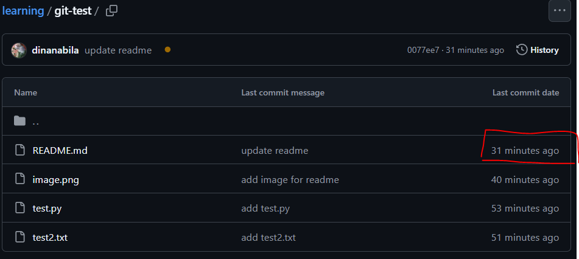
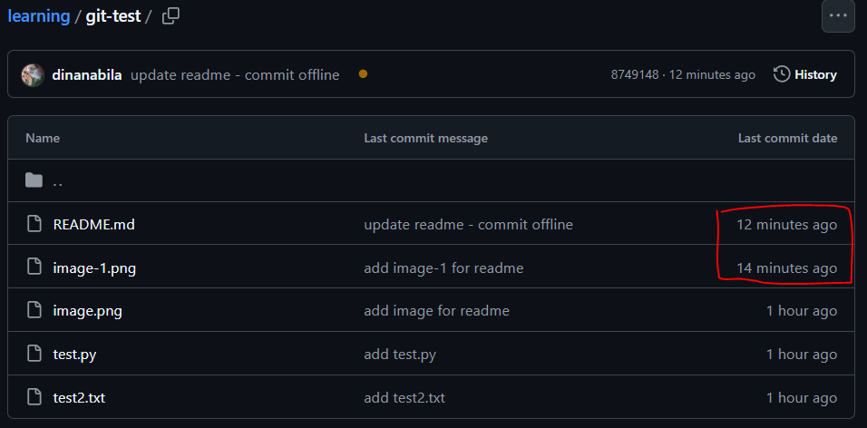

**Tujuan**: ngetes alur kerja git

Di sini aku ngetes, 
*"kalau commit doang di vscode tanpa nge-push,*
*terus nge-push nya setelah beberapa commit udah dibikin,*
*kira-kira apa yang terjadi?"*

List commit berturut-turut sebelum push:
1. bikin subrepo baru
2. bikin readme.md
3. update readme.md
4. bikin test.py
5. update readme.md
6. bikin test2.txt
7. update readme

Yang terjadi adalah ini:

Time per commit nya ke-reserved, 
jadi ga based on kapan nge-pushnya. 
Yang alhasil, 
masing-masing last created commit nya tercetak based on masing-masing commit. 
**insight: created time per commit nya independen, bukan based on waktu push.** 

Yang perlu dicatat juga, 
**kalau perubahan yang kita bikin belum di-save di lokal,** 
**file-nya ga ikut ke-commit.** 
Jadi pastiin di-save dulu sebelum commit. 

*"Lalu apa yang terjadi kalau late push?"*
Di sini aku coba commit update-an readme ini pukul 15.00.

Aku bakal push pukul 15.30, terus cek, apa yang terjadi?
---> jawab: last created commit nya tetap ter-reserved. 
Tercatat +-30 menit yang lalu, bukan "now". 

Jadi, waktu commit tetap ter-reserved, ga peduli kapan waktu push-nya = **valid**.

Pertanyaan selanjutnya: *"gimana kalau commit nya offline?"*

Yang terjadi adalah ini:

Walaupun commit nya pas offline dan vscode nya kututup, 
ternyata tetap reserved juga last commit date per commit-nya pas di-push online sekaligus.

Jadi, commit berturut-turut pas **offline** sebelum push pas online sekaligus = **valid**. 